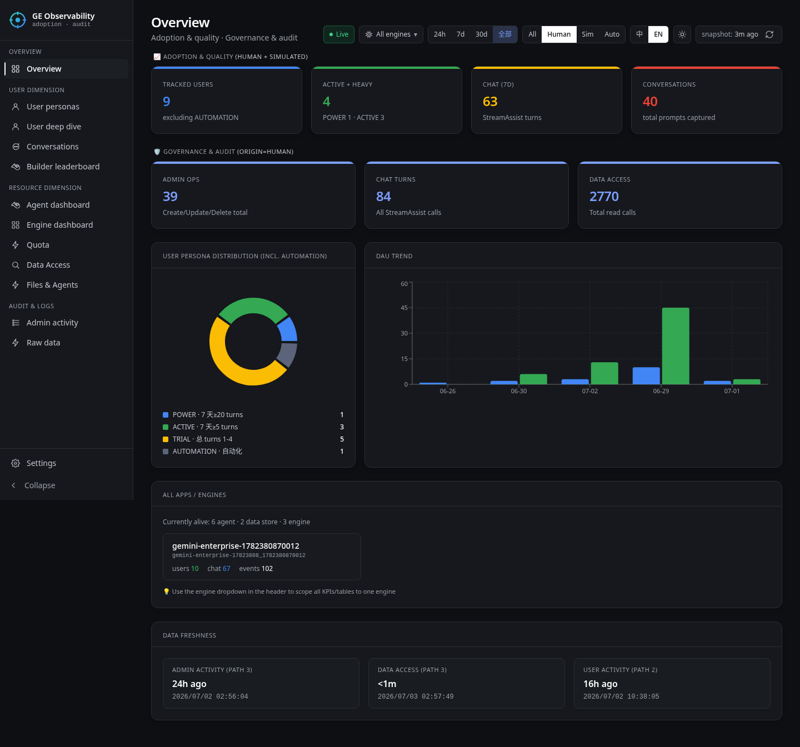

# GE Observability

> **Language**: English · [中文](./README.zh-CN.md)



Self-hosted dashboard for **Gemini Enterprise** adoption, governance, and audit.
Pipes Cloud Logging → BigQuery → React + FastAPI.

Answers questions like:
- Who's a **power user / active consumer / trial / lurker**?
- Who built which **agent / engine / data store**?
- What **prompts** did users send, and what did the model answer?
- Which **engine** is most popular?
- Which **seats** are claimed but unused?
- How many **Deep Research / NotebookLM / custom agent** calls — and by whom, exactly which calls?

## Docs

- **[Deployment guide](./docs/DEPLOYMENT.md)** — prerequisites, two-phase deploy, verification checklist, step-by-step debug
- **[Troubleshooting](./docs/TROUBLESHOOTING.md)** — symptom → cause → fix for the common failure modes
- **[Known Limitations](./docs/KNOWN_LIMITATIONS.md)** — 20 items grouped by Data / API / Deploy / Operational
- **[Changelog](./CHANGELOG.md)** — user-visible changes, newest first
- **[Invariants](./infra/contexts/deploy/INVARIANTS.md)** — deploy-time invariants each fix relies on
- **[GE Console setup](./docs/GE_CONSOLE_SETUP.md)** — the one manual GE toggle (`Enable Feedback`) that still can't be auto-flipped
- **[Ops runbook](./docs/RUNBOOK.md)** — refresh, rotate, backfill playbooks

---

## Pages

| Page | What it shows |
|---|---|
| **Overview** | DAU trend, persona donut, audit/usage KPIs, engine list, data freshness |
| **User picker** | Sortable + searchable directory: every user × every feature they touched |
| **User deep dive** | One user, every metric drillable to the underlying audit events |
| **Agent dashboard** | Per-agent rollup (Deep Research / NotebookLM / custom), user breakdown, event timeline |
| **Conversations** | Prompt + response bubbles, filter by matched / prompt-only |
| **Data Access** | Per-method audit-log bucketing with NotebookLM, A2A, Deep Research columns |
| **Files & Agents** | Session file activity + custom agent navigation |
| **Builders** | Who created / updated / deleted which resources |
| **Admin Activity** | Path 3 audit-log timeline |
| **Quota** | Per-feature usage vs purchased seats, tier config, seat inventory |
| **Settings** | Snapshot refresh status + data source config |

---

## Quick start

```bash
git clone https://github.com/coolsocket/gemini-enterprise-observability
cd gemini-enterprise-observability

# One-time setup: venv + npm deps + .env template + health check
make install

# Fill in your GCP project ID etc
$EDITOR .env

# Authenticate for Python + Terraform
gcloud auth application-default login

# Preview locally (BQ dataset must already exist — see full deploy guide)
make serve
open http://127.0.0.1:8000
```

For a fresh GCP project that doesn't have the dashboard's BQ dataset / sink yet:

```bash
make deploy-infra          # provision + build + bootstrap
# (manual: enable one toggle in GE Console, send a bit of traffic)
make deploy-views          # apply analytical views once logs flow
```

Full walkthrough with verification checklist: **[docs/DEPLOYMENT.md](./docs/DEPLOYMENT.md)**.

Stuck? Try **`make doctor`** (non-destructive env check) or the
**[Troubleshooting guide](./docs/TROUBLESHOOTING.md)**.

---

## Architecture

```
GE user actions (UI + REST)
        ↓ logs
Cloud Logging (audit + gen_ai + user_activity)
        ↓ Logs Router sink
BigQuery dataset: ge_observability
   • raw sink tables
   • ~21 analytical views (v_*)
   • materialized snapshots (s_*, 6h refresh)
   • quota_config + engine_metadata + …
        ↓ google-cloud-bigquery
FastAPI on Cloud Run (or local)
        ↓ fetch
React 18 + Vite + Tailwind (中 / EN i18n)
```

Full log-name inventory, table names, and view→snapshot mapping in
**[docs/DEPLOYMENT.md § Architecture details](./docs/DEPLOYMENT.md)**.

---

## Local development

Two-terminal HMR loop:

```bash
make api-run                       # FastAPI on http://127.0.0.1:8000 (--reload)
cd apps/web && npm run dev         # Vite on http://127.0.0.1:5173 (proxies /api → :8000)
```

Or single-process preview (built frontend served by FastAPI):

```bash
make serve PORT=8011
ssh -L 8011:127.0.0.1:8011 <remote-host>   # if running on a remote box
open http://localhost:8011
```

Tests:

```bash
.venv/bin/pytest tests/unit/         # 25 assertions, all static (no BQ needed)
```

---

## Repo layout

Bounded-context layout (after 2026-07-06 TDDD refactor):

```
ge-observability-service/
├── apps/api/                             # FastAPI backend, DDD-ish split
│   ├── main.py                           # ~50 lines: wire routers + startup
│   ├── shared/
│   │   ├── common.py                     # cross-cutting: _json_safe, valid origins
│   │   └── infrastructure/bq_client.py   # THE bigquery.Client singleton + config
│   ├── routes/                           # thin HTTP layer per bounded context
│   │   ├── meta.py    observability.py   quota.py   refresh.py   spa.py
│   └── contexts/                         # per-context domain (pure, no I/O)
│       ├── observability/
│       │   ├── INVARIANTS.md             # INV-obs-001 (snapshot fallback), INV-obs-002 (refresh precheck)
│       │   └── domain/
│       │       ├── view_registry.py      # VIEWS + VIEWS_WITH_* + snapshot_name
│       │       └── query_builder.py      # QuerySpec, build_query_spec, render_sql
│       └── quota/
│           ├── INVARIANTS.md             # INV-quota-001 (seats = licenseConfigs.total)
│           └── domain/
│               ├── license_parse.py      # pure: parse_license_configs(api_json)
│               └── tier_allocation.py    # pure: allocate_seats(purchased, assigned, default)
├── apps/web/src/                         # React 18 + Vite + Tailwind
├── infra/
│   ├── sql_templates/views.sql.tmpl      # 21 BQ views
│   └── contexts/deploy/
│       ├── INVARIANTS.md                 # INV-001 (BQ_LOCATION follows REGION)
│       └── application/                  # doctor / preflight / bootstrap / apply_views / import_orphans
├── terraform/                            # dataset + sink + IAM + AR + Cloud Run
├── docs/                                 # DEPLOYMENT / TROUBLESHOOTING / KNOWN_LIMITATIONS / GE_CONSOLE_SETUP / RUNBOOK
├── tests/unit/                           # 25 regression assertions
├── playground/                           # audit-log reverse-engineering notes
├── CHANGELOG.md
├── Makefile                              # install / doctor / serve / deploy-* / resume
├── pyproject.toml                        # Python ≥ 3.9
└── LICENSE                               # Apache 2.0
```

---

## Key contributors

- [**@panliuyang-debug**](https://github.com/panliuyang-debug) — deep audit-log detective work on a fresh-project deploy (issue [#1](https://github.com/coolsocket/gemini-enterprise-observability/issues/1)). Discovered `Engine.observabilityConfig` is a real API field (removed the manual GE Console click step) and that `jsonPayload.serviceTextReply` carries UI chat responses inline (moved pairing rate from ~10% to ~60%). Also reported five smaller bugs across Cloud Run / terraform / SQL — all fixed in [`a5a3d3f`](https://github.com/coolsocket/gemini-enterprise-observability/commit/a5a3d3f).

Contributions welcome — issues, PRs, and audit-log war stories all appreciated.

---

## License

Apache 2.0 — see [`LICENSE`](./LICENSE). Built by Claude Code (Opus).
