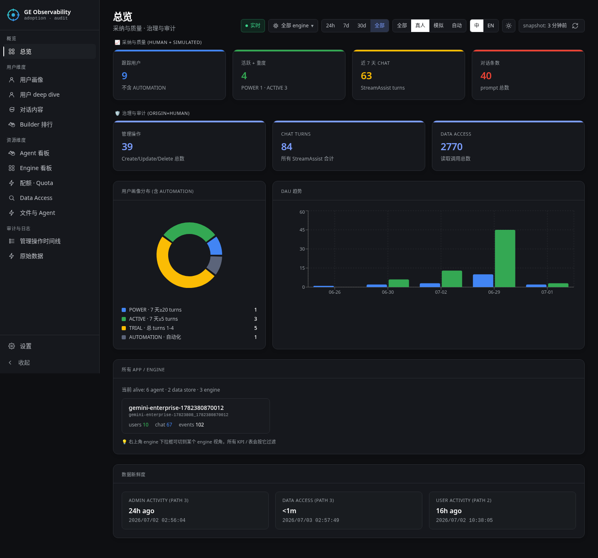

# GE Observability

> **语言**: [English](./README.md) · 中文



**Gemini Enterprise** 用户采纳 / 治理 / 审计的自部署 dashboard，
Cloud Logging → BigQuery → React + FastAPI 全套打通。

回答的问题：
- 谁是 **POWER_USER / ACTIVE_CONSUMER / TRIAL / LURKER**？
- 谁建了哪个 **agent / engine / data store**？
- 用户问了什么 **prompt**，模型怎么答的？
- 哪个 **engine** 最受欢迎？
- 哪些 **seat** 占了但没用？
- **Deep Research / NotebookLM / 自建 agent** 各调用了多少次，谁调的，具体哪几次？

---

## 目录

- [页面](#页面) —— 每个 tab 展示什么
- [架构](#架构) —— 数据流、为啥用 BQ + FastAPI + React
- [部署到自己的 GCP 项目](#部署到自己的-gcp-项目)
  - [前置条件](#前置条件) —— 本地工具 / GCP 状态 / 鉴权
  - [完整端到端验证清单](#完整端到端验证清单) —— ~14 项打勾直到 green
  - [两阶段部署 (新项目推荐)](#两阶段部署-新项目推荐)
  - [预览 dashboard](#预览-dashboard) —— 本地 vs Cloud Run
  - [分步走 (debug)](#分步走-debug)
  - [常见坑排查](#常见坑排查) —— 6 种常见失败
- [本地开发](#本地开发) —— `make api-run` + Vite HMR
- [仓库结构](#仓库结构)
- [已知限制](#已知限制) —— 20 项,四类分组
  - [数据 — GE 不 emit 的信号](#数据--ge-不-emit-的信号)
  - [API — service account 做不了的事](#api--service-account-做不了的事)
  - [部署 — 自动化外的手工步骤](#部署--自动化外的手工步骤)
  - [运维 — 新鲜度 + 性能](#运维--新鲜度--性能)
- [鉴权](#鉴权) —— runtime SA + IAM
- [运维任务](#运维任务) —— 刷新 / 轮换 / 补数
- [变更日志](#变更日志) —— 用户可见变化,最新在上
- [核心贡献者](#核心贡献者)
- [License](#license) —— Apache 2.0

---

## 页面

| 页面 | 内容 |
|---|---|
| **总览** | DAU 趋势 · persona 分布饼图 · KPI 卡片 · engine 列表 · 数据新鲜度 |
| **用户 deep dive (员工目录)** | 可搜索 + 可排序 + 可过滤的员工列表，每人 × 每个 feature 一目了然 |
| **用户 deep dive (单人)** | 单用户全部活动；每个数字可点开看具体哪几次 |
| **Agent 看板** | 按 agent 聚合 (Deep Research / NotebookLM / custom)，用户分布 + 事件 timeline |
| **对话内容** | Prompt + response 气泡，按"有响应 / 仅 prompt" 过滤 |
| **Data Access** | 每个 method 桶展示 (含 NotebookLM / A2A / Deep Research 列) |
| **文件与 Agent** | Session 文件活动 + 自建 agent 入口浏览 |
| **Builder 排行** | 谁创建/更新/删除了哪些资源 |
| **管理操作时间线** | Path 3 audit log 时间线 |
| **设置** | Quota 配置 + snapshot 刷新状态 + 数据源配置 |

---

## 架构

```
┌──────────────────────────────────────────────────────────────────┐
│ 1) GE 用户操作                                                    │
│    真人 → GE 控制台 UI    /    SA → REST → Discovery Engine        │
└──────────────────────────────────┬───────────────────────────────┘
                                   ↓
┌──────────────────────────────────────────────────────────────────┐
│ 2) Discovery Engine emit 日志到 Cloud Logging                     │
│                                                                  │
│   Path 2 — 业务日志 (在 GE 控制台开关控制)：                       │
│   • discoveryengine.googleapis.com/gemini_enterprise_user_activity │
│   • discoveryengine.googleapis.com/gen_ai.user.message           │
│   • discoveryengine.googleapis.com/gen_ai.choice                 │
│                                                                  │
│   Path 3 — 审计日志 (GCP 平台层)：                                 │
│   • cloudaudit.googleapis.com/activity     (默认开)               │
│   • cloudaudit.googleapis.com/data_access  (要手动启)             │
└──────────────────────────────────┬───────────────────────────────┘
                                   ↓ Logs Router sink
┌──────────────────────────────────────────────────────────────────┐
│ 3) BigQuery dataset: ge_observability                            │
│    • 5 张原始表 (sink 自动落)                                     │
│    • 18 个分析 view (v_*)                                         │
│    • 18 个 snapshot 表 (s_*, 每 6h 物化一次)                       │
│    • engine_metadata + resources_alive + quota_config            │
└──────────────────────────────────┬───────────────────────────────┘
                                   ↓ google-cloud-bigquery
┌──────────────────────────────────────────────────────────────────┐
│ 4) FastAPI on Cloud Run (IAM 限定 invoker)                        │
│    GET /api/v/{view}?origin=&engine_id=&live=                    │
│    GET /api/user/{email}      — 单用户 deep dive                  │
│    GET /api/agent/{agent_id}  — 单 agent 聚合                     │
│    POST /api/refresh          — 重新物化 snapshot                 │
└──────────────────────────────────┬───────────────────────────────┘
                                   ↓ fetch()
┌──────────────────────────────────────────────────────────────────┐
│ 5) React 18 + Vite + Tailwind (中/EN 双语) → 浏览器                │
└──────────────────────────────────────────────────────────────────┘
```

---

## 部署到自己的 GCP 项目

### 前置条件

开始之前请确认以下都到位:

**本地工具在 `PATH` 里**
- `gcloud` (Cloud SDK ≥ 460)
- `terraform` ≥ 1.5
- `python3` ≥ 3.11 + `pip`
- `npm` ≥ 8 (只有想改前端时需要;容器构建自己会装)
- `make`

**GCP 项目状态**
- 项目已建、billing 已开 (`gcloud beta billing projects link ...`)
- 你有 **Owner** 或 (Editor + Security Admin + Project IAM Admin) —— Terraform 要启用 API、授 role
- **Gemini Enterprise engine 已在目标项目里**(本仓库只观察,不建 GE)
- **Cloud Build API 预先启用** 好让 `make image` 第一次就通:`gcloud services enable cloudbuild.googleapis.com --project=<project>` (Terraform 会启,但顺序不对时先被这个卡)

**认证 (两个都要)**
- `gcloud auth login` —— Terraform + Cloud Build CLI 用
- `gcloud auth application-default login` —— Python 脚本 (`apply_views.py`, `bootstrap.py`) 和 FastAPI 后端都走 ADC

### 完整端到端验证清单

`terraform apply` 跑完不等于部署完成 —— 有几步依赖你**手动**去 GE 控制台开 toggle,还有几步要等 Logs Router 真的把日志送过来。照这个清单一项项打勾,才算真正 green:

- [ ] `make deploy-infra PROJECT=<p> REGION=<r>` 退出码 0
  - 建 24 个资源 (BQ dataset、sink、6 张 metadata 表、IAM、audit-config、Artifact Registry 仓库、service account)
  - build + push 镜像到 Artifact Registry
  - `bootstrap.py` 装 `engine_metadata` / `datastore_metadata` / `resources_alive`,seed `quota_config` (含真实 seat 数)
- [ ] Terraform 的 `dataset_full_name` 输出打印你的 project 和 dataset
- [ ] `bq ls <project>:<dataset>` 能看到 6 张 metadata 表
- [ ] 打开每个 engine 的 **GE Admin 控制台**,翻开 toggle:
  - [ ] OpenTelemetry Instrumentation (生成 `trace_id`,用来配对 prompt+response)
  - [ ] Prompt & Response Logging (写 `gen_ai.user.message` + `gen_ai.choice`)
  - [ ] Feedback (可选;开了才能捕获点赞点踩)
  - 带截图的完整步骤:`docs/GE_CONSOLE_SETUP.md`
- [ ] 产生真实 GE 流量 —— 至少:每个 engine 一条 chat,一次 Deep Research 提交,一次 NotebookLM 交互
- [ ] 等 ~2-5 分钟让 Logs Router 送第一批日志。确认:
  ```bash
  bq ls -a <project>:<dataset> | grep -E 'cloudaudit_|discoveryengine_'
  ```
  应该能看到 `cloudaudit_googleapis_com_activity`、`cloudaudit_googleapis_com_data_access`,以及 (chat/DR 触发过后) `discoveryengine_googleapis_com_gemini_enterprise_user_activity` 和 `..._gen_ai_choice`。缺哪个继续发对应类型的流量 —— BQ 在第一条匹配日志落下时才自动建表。
- [ ] `make deploy-views PROJECT=<p>` —— 现在应该 **全 green**:`applied 21/21 views`,零 waiting / cascade / real error。如果还有 waiting,对应的 audit log 表还没收到第一条,继续发对应流量再重跑即可。
- [ ] `make serve PROJECT=<p>`,浏览器开 `http://127.0.0.1:8000` —— 每个页面都点一遍:Overview、Users、User Deep Dive、Agents、Engines、Conversations、Data Access、Quota、Settings。不应该有"一直 loading"或 500。
- [ ] Quota 页面 "Seats" 面板显示非零 `license.total_seats` (从 `licenseConfigs` 实时拉)
- [ ] 想上 Cloud Run: `terraform.tfvars` 里设 `deploy_cloud_run = true` + 加 `iap_invokers = […]` + `make tf-apply` 再跑一次,然后 `gcloud run services proxy ge-observability --port 8080 --region <r>`

上面任何一项超过几分钟还是红,下面的 Troubleshooting 章节列了最常见的原因。

### 两阶段部署 (新项目推荐)

```bash
git clone https://github.com/coolsocket/gemini-enterprise-observability
cd gemini-enterprise-observability

# ---------- 阶段 A: 基础设施 + 镜像 + metadata ----------
make deploy-infra PROJECT=my-project REGION=us-central1
# 跑: terraform apply → gcloud builds submit → bootstrap.py
#
# `REGION` 控制什么 (默认 us-central1):
#   • Artifact Registry 仓库位置 (镜像存哪)
#   • Cloud Run 服务位置 (如果 deploy_cloud_run=true, dashboard 跑在哪)
# 它**不控制** BigQuery dataset 位置 —— 那是 terraform/variables.tf 里的
# `bq_location` (默认 `US` multi-region)。Log Router sink 是 global。
# 选离用户近的 region;之后要改需要 tf-destroy + 重 apply,因为 Cloud Run
# 和 Artifact Registry 都是区域性资源。

# ---------- 手工步骤 ----------
# GE Admin 控制台每个 engine 打开:
#   - OpenTelemetry Instrumentation      (生成 trace ID)
#   - Prompt & Response Logging          (写 gen_ai.* 日志)
#   - Feedback                           (可选)
# 详见 docs/GE_CONSOLE_SETUP.md
#
# 然后跑一点流量 (chat / deep research / 打开 notebook), 等 ~2-5 分钟让日志落到 BQ。

# ---------- 阶段 B: 建分析视图 ----------
make deploy-views PROJECT=my-project
```

为啥要拆:BigQuery 只在第一条匹配日志真正流进来的时候才创建 sink 目标表 (`cloudaudit_googleapis_com_data_access`, `discoveryengine_googleapis_com_*`)。`make deploy-views` **幂等** —— 可以随便重跑,还会告诉你哪几个 view 还在等源表,你就知道要等啥。

### 预览 dashboard

默认 **只本地跑** (`deploy_cloud_run = false`),不用为 Cloud Run 掏钱:

```bash
make serve PROJECT=my-project    # http://127.0.0.1:8000
```

要正式上 Cloud Run? 编辑 `terraform/terraform.tfvars`:

```hcl
deploy_cloud_run = true
iap_invokers     = ["user:alice@example.com", "group:ge-users@example.com"]
```

然后 `make tf-apply PROJECT=my-project`,打开:

```bash
gcloud run services proxy ge-observability --port 8080 --region us-central1
open http://localhost:8080
```

### 分步走 (debug)

```bash
make tf-plan   PROJECT=my-project    # 预览
make tf-apply  PROJECT=my-project    # 建基础设施 + Artifact Registry repo
make image     PROJECT=my-project    # build + push 镜像到 AR
make bootstrap PROJECT=my-project    # seed metadata
# (手动开 GE 控制台 toggle + 跑一点流量)
make views     PROJECT=my-project    # apply BQ view (重跑直到全部通过)
```

### 常见坑排查

**`make views` 报 "N view(s) skipped — waiting for log-sink tables"**
新项目上正常。列出来那些表 (`cloudaudit_googleapis_com_*`, `discoveryengine_googleapis_com_*`) 只有 Logs Router sink 实际送过一条记录后,BQ 才会建。开好 GE toggle、发几条 chat、等 ~2 分钟,再跑 `make views` —— 计数会一路减到 0。

**`gcloud builds submit` 在 `gcr.io/...` 报 `NOT_FOUND`**
`gcr.io` (Container Registry) 2024 年 2 月被 Google 废弃,之后建的 project 都没有。本仓库已经迁到 Artifact Registry —— 确保你在最新 `main` 上,`IMAGE` 变量解析出 `<region>-docker.pkg.dev/...`。先跑 `make tf-apply` 让 Terraform 建 AR repo,再跑 `make image`。

**第二次 `terraform apply` 报 `Error 409: Already Exists`**
第一次 `tf-apply` 被中断了 (权限、quota、网络抖动、Ctrl-C),部分资源已经在 GCP 里创建但还没写进 terraform state。第二次 apply 想重新建 → 409。恢复:

```bash
make tf-import-orphans PROJECT=<你的项目> REGION=<region>
make tf-apply          PROJECT=<你的项目> REGION=<region>
```

`tf-import-orphans` 对每个可能泄漏的资源都跑 `terraform import` (dataset + 6 张 metadata 表、service account、log sink、Artifact Registry repo、audit config、已启用的 API,还有 Cloud Run 如果开了)。**幂等** —— "已在 state 里"和"不存在"都当 no-op,可以随便重跑。

**Cloud Run URL 返回 403**
把调用方加到 `terraform.tfvars` 的 `iap_invokers` 里再 apply。没走 IAP 用 `roles/run.invoker`,走了 IAP 用 `principal://` 格式。还是 403 就看看 Cloud Run 是否要求 auth。

**`make views` 报 `Not found: Table quota_config`**
`make bootstrap` 跳了。那步创建 view 引用的 metadata 表 (`terraform apply` 也会幂等地建 —— 如果 apply 成功后还看到这个错,检查 `PROJECT` 和 `DATASET` 两边一致)。

**运行时 API 返回 BigQuery 查询 403**
runtime SA (`ge-observability-sa@…`) 要在 project 上有 `roles/bigquery.jobUser`,dataset 上有 `roles/bigquery.dataViewer`。Terraform 都授了 —— 如果你在 Terraform 外重命名了 dataset,重新 apply 让 IAM 跟上。

**`bootstrap.py` 报 `licenseConfigs` 404 或 403**
你的 GE 部署可能还没 `licenseConfigs` API 响应 (非常新的 tenant),或调用方缺 `roles/discoveryengine.viewer`。脚本会优雅降级 —— Quota 页面的 seat 数会 fallback 到 `quota_config` 表里已经存的值。

---

## 本地开发

```bash
make install                              # 装 python venv + npm 依赖
make api-run                              # FastAPI 起在 http://127.0.0.1:8000
# 另开一个 terminal:
cd apps/web && npm run dev                # Vite HMR
```

或者单进程 preview (build 完的前端由 FastAPI 直接服务)：

```bash
make serve PORT=8011
ssh -L 8011:127.0.0.1:8011 <remote-host>  # 跑在远程机器上的话
open http://localhost:8011
```

---

## 仓库结构

```
ge-observability-service/
├── apps/
│   ├── api/                              # FastAPI 后端
│   │   ├── main.py
│   │   └── requirements.txt
│   └── web/                              # React 18 + Vite + Tailwind 前端
│       ├── src/pages/                    # Overview · UserDeepDive · Agents · Conversations · …
│       ├── src/components/               # Sidebar · Header · Card · DataTable · Brand
│       └── src/i18n.tsx                  # 中/EN 词典
├── infra/
│   ├── sql_templates/views.sql.tmpl      # 18 个 view，{{PROJECT}} / {{DATASET}} / {{SIM_PATTERN}} 占位
│   └── scripts/
│       ├── apply_views.py                # render + apply view 到 BigQuery
│       └── bootstrap.py                  # 拉 engine/datastore/agent 元数据
├── terraform/
│   ├── main.tf                           # API + dataset + sink + audit + SA + Cloud Run + Scheduled Query
│   ├── variables.tf
│   ├── terraform.tfvars.example
│   ├── snapshot_refresh.sql.tftpl        # 每 6h 重物化 query 模板
│   └── README.md
├── docs/
│   ├── RUNBOOK.md                        # 运维任务 + 故障排查
│   └── GE_CONSOLE_SETUP.md               # GE 管理员需要点的 3 个 toggle
├── Dockerfile                            # 多阶段：node build + python runtime
├── Makefile                              # install / serve / dev / deploy / tf-* / image / views / bootstrap
└── README.md                             # ← 这文件
```

---

## 已知限制

Dashboard 展示的所有信号都来自 GE 真正 emit 的东西。下面是**看不到**或**做不到**的,按类别分好方便查:

### 数据 — GE 不 emit 的信号

1. **Chat prompt ↔ response 配对** (2026-07-06 基本解决)。两条路径:(a) `v1alpha` REST 聊天走 `gen_ai.choice` 配对 (`trace_id`,含 reasoning + finish_reason);(b) UI (`v1main`) 不写 `gen_ai.choice`,但只要 `sensitiveLoggingEnabled=true` (bootstrap 自动开),模型响应文本会内嵌在同一行 `user_activity` 的 `jsonPayload.serviceTextReply` 里。`v_conversations_with_response` `COALESCE` 两条路径。实测配对率从 ~10% 提到 ~60%。剩余 `no_response` 通常是 Deep Research 响应 (见下) 或错误。

2. **Deep Research prompt + response 内容,以及计数可信度**。DR 响应本身不 emit 到 Cloud Logging —— 看内容还是要去 GE 后台 Deep Research 任务列表。**关于计数**: `AssistantService.AsyncAssist` 是我们对"一次 DR 提交"的代理,但 GE (2026-07) 在普通聊天时也会同时触发 AsyncAssist —— 一条"帮我查一下深圳的天气"的 prompt 在同一秒触发了 `StreamAssist` 和 `AsyncAssist` + `ReadAsyncAssist` (线上审计日志验证过)。`resourceName` 两种场景都是 `.../assistants/default_assistant`,无法区分。现在的做法:候选 prompt 已经跟正常聊天响应配对时不再归因给 DR —— 但 AsyncAssist 总数本身可能虚高。桶名保留 `deep_research` 兼容前端,hint 里加了提示。

3. **图片 / 视频 / idea 生成**。GE 后端跑在 Google 内部,不发 customer audit log。2026-07-06 从 Quota dashboard 下掉了 —— 之前的 prompt 关键词启发式会把"总结一下这个视频"这种误分类。`quota_config` 里的 `tier_limit` 配置保留,以后 GE 出真计数器再复活。

4. **多模态上传**。`streamAssist` 不接受 `inlineData`,图片/文件走单独 session-file 流程。Dashboard 展示 `session_files` 计数,但看不到内容。

5. **内置 agent 跟 chat 区分不开**。Idea Generation / Co-Scientist / AlphaEvolve 全部走 `AssistantService.StreamAssist`。agent 引用在 request body 里 —— 要拆开得开 DATA_WRITE audit log + payload capture (默认关)。

6. **Custom agent 调用只能看导航不知调用**。点开 detail 页时 `UserEventService.WriteUserEvent` 带 `agentinfo.{agentid,name}` (Agents 页展示的 nav events),但实际调用要么走 StreamAssist (跟 chat 混),要么走 A2A (在 `a2a_invocations` 里)。

7. **A2A 无 per-agent 细分**。A2A 调用总量在 `a2a_invocations`,还没按目标 agent 拆分。

8. **CreateAgent 缺新 agent 的 resource ID**。audit log `resourceName` 是 parent (`assistants/default_assistant`) 不是新 agent ID。所以"哪个 user 建了哪些 alive 资源"没法追溯。总览页 fallback 用 `ListAgents` API 查全系统 alive 数。

### API — service account 做不了的事

9. **NotebookLM API 对 SA 完全封锁**。就算 custom role 授全 `discoveryengine.notebooks.*` 权限,SA 调用还是 `403 "The caller does not have permission"`。gate 在 NotebookLM 服务层 (workforce identity + Regional Access Boundary registry),不在 IAM 层。试图绑 role 时会看到 `Regional Access Boundary HTTP request failed... Account not found for email: <hash>|<user>` warning —— 只是提示 (绑定实际成功),表明底层 gate 存在。完整证据见 [`playground/de-api-probe/notebooklm-sa-gate.md`](./playground/de-api-probe/notebooklm-sa-gate.md)。

10. **Deep Research REST API 对 SA 封锁**。`AsyncAssist` 在公开的 `v1alpha` Discovery Engine schema 里根本没有 —— 是 UI 内部 (`v1main`) 的 method,同一个 workforce-identity gate。SA 不能程序化提交 DR。真人在 UI 里发起的 DR 我们**能**从 audit log 看到,只是没法从代码生成。

11. **生成的文件无法通过 API 下载**。`StreamAssist` 可以正常生成图 (Nano Banana 2) 或视频,并在流式响应里返回 `fileId`,但下载端点 (`sessions/{sid}:listFiles`, `:getFile`, `:downloadFile`) 全部返回 `403 "Session is not owned by the provided user"` —— 同一个 workforce gate。文件只能在 GE UI 里看。完整证据见 [`playground/ge-generation-probe/FINDINGS.md`](./playground/ge-generation-probe/FINDINGS.md)。

12. **Deep Research vs Search vs grounded-answer 是三个独立 service**。DR = `AssistantService.AsyncAssist`,Search API = `SearchService.Search`,grounded-answer = `ConversationalSearchService.GetAnswer`。我们的计数器分开桶,DR 永远不会跟 Search 混。

### 部署 — 自动化外的手工步骤

13. **GE engine 必须预先建好**。本仓库观察一个已有的 GE 部署,不建。先去 GE Admin Console 建 engine。

14. **GE Console toggle 大部分已自动化** (2026-07-06)。`bootstrap.py` 现在通过 Discovery Engine API `PATCH` 每个 engine 的 `observabilityConfig` 字段 —— `observabilityEnabled` (OpenTelemetry) + `sensitiveLoggingEnabled` (Prompt & Response Logging) 自动开。**只有"Enable Feedback"**还要手工去 GE Admin Console 点。要跳过自动化: `SKIP_OBSERVABILITY=true make bootstrap`。见 [`docs/GE_CONSOLE_SETUP.md`](./docs/GE_CONSOLE_SETUP.md)。

15. **Sink 目标表是懒创建的**。`cloudaudit_googleapis_com_data_access` 和 `discoveryengine_googleapis_com_*` 只在第一条匹配日志真到达 sink 的时候才被 BigQuery 自动建。`make deploy-views` 会报哪些还在等,而且**幂等** —— 流量流过之后重跑即可。

16. **Cloud Run 访问需要手工配 IAP**。默认 `deploy_cloud_run = false`。改成 true 会建服务,但你还得在 `terraform.tfvars` 里加 `iap_invokers = […]`,以及 (通常) 配 Identity-Aware Proxy 才能外部访问。

### 运维 — 新鲜度 + 性能

17. **Snapshot 刷新周期 6 小时**。Dashboard 页面读的 `s_*` 快照表由 BigQuery Scheduled Query 每 6 小时刷。手动刷:`POST /api/refresh` (Settings 页有按钮)。live `v_*` view 永远是最新的但更慢。

18. **Seat 数刷新周期 24 小时**。`licenseConfigs` 在 API 启动时 + 每 24 小时被后台 asyncio 任务拉一次。手动刷:`POST /api/refresh/seats`。Cloud Run 冷启动触发新一次拉取;长期运行的进程一天准一次。

19. **PII 脱敏只有正则**。`v_conversations` 脱敏 email / 电话 / ID 数字 / 信用卡数字。**不是完整 DLP** —— 人名、地址、长文本 PII 都会透过来。生产上再叠一层 Cloud DLP。

20. **`quota_config.default_tier` 决定 seat-to-tier 分配**。总配额 = `Σ 各 tier (tier 的 seats × 该 tier 的 per-feature 上限)`。`user_tier` 表里显式分配过的用户按其分配算;剩余未分配的 seats 按 `quota.default_tier` (默认 `plus`) 填。Quota 页面 tier 配置编辑器里可改默认。

---

## 鉴权

Cloud Run 用 `--no-allow-unauthenticated` 启动，只有 `roles/run.invoker` 持有者能命中。

- **本地浏览器临时访问**：
  ```bash
  gcloud run services proxy ge-observability --port 8080 --region us-central1
  ```
- **生产 SSO**：通过 Cloud Console (Security → Identity-Aware Proxy) 加 Cloud IAP，再把组加到 `terraform/terraform.tfvars` 的 `iap_invokers`。

---

## 运维任务

- **手动刷 snapshot**：dashboard header 点 ⟳ (或 `POST /api/refresh`)
- **定时刷新**：BigQuery Scheduled Query 每 6h 跑 (在 `terraform.tfvars` 设 `enable_scheduled_refresh = true`，前提是 `make views` 已经跑过至少一次)
- **加模拟用户**：见 [`docs/RUNBOOK.md#simulate-users`](./docs/RUNBOOK.md)
- **接入新 engine**：再跑一次 `make bootstrap PROJECT=…` 同步 `engine_metadata`

---

## 变更日志

用户可见行为、配额语义、dashboard 数据模型变化时请更新此列表。最新在上。完整详情看 `git log`。

- **2026-07-06** — 修 [issue #1](https://github.com/coolsocket/gemini-enterprise-observability/issues/1) (panliuyang-debug 提的 fresh project 部署 8 点踩坑): (a) `google_cloud_run_v2_service` 里删掉 `PORT` env var —— Cloud Run 自动注入,provider v6 起显式设置会被拒绝; (b) Cloud Run 资源加 `deletion_protection = false`,避免首次部署失败之后需要 `terraform state rm` 才能恢复; (c) Cloud Run `depends_on` 加了 `google_artifact_registry_repository.dashboard`,顺序正确; (d) `bootstrap.py` 现在通过 Discovery Engine API `PATCH` 每个 engine 的 `observabilityConfig` (`observabilityEnabled` + `sensitiveLoggingEnabled`) —— **不再需要去 GE Admin Console 点击**了 (只有 "Enable Feedback" 仍需手工)。`SKIP_OBSERVABILITY=true` 可跳过; (e) **配对大改善**: `v_conversations_with_response` 现在 `COALESCE` `gen_ai.choice` (trace-JOIN) 和 `user_activity.jsonPayload.serviceTextReply` —— 纯 UI 对话的配对率从 ~10% 提到 ~60%。新 `join_status` 值:`matched_gen_ai_choice` / `matched_service_reply` / `no_response`; (f) DR 归因诚实度: 报告人证明了普通聊天会触发 AsyncAssist (跟 StreamAssist 同时发,审计日志逐字节一致,`resourceName` 也没区别) —— `v_deep_research_prompts` 现在会跳过已经跟正常聊天配对的 prompt,Quota 的 DR feature hint 加了不精确警告。`docs/GE_CONSOLE_SETUP.md` 反映新的 API 自动化。
- **2026-07-06** — `已知数据边界` 章节重整成 `已知限制`,20 条按四类分组:数据(GE 不 emit 的信号)、API(SA 做不了的事)、部署(自动化外的手工步骤)、运维(新鲜度/PII/tier 分配)。全部条目更新,删掉一条过时的"没有 seat API"(现在用 `licenseConfigs`),补进最新发现的 SA 无法下载文件和 Search-vs-DR 区分。中英双语。
- **2026-07-06** — Deep Research 计数两处一致性修复:(a) `v_data_access_summary.deep_research_calls` 之前把 `AsyncAssist` (提交) **和** `ReadAsyncAssist` (UI 轮询) 都算进去,单用户被虚高 3-5 倍。现在跟 `v_daily_usage_per_user` 对齐 —— 只算提交。两天各跑 2 次 DR 的用户,Quota 页和 User Deep Dive 都显示 `4`,不再出现 `4` vs `12` 的不一致。(b) 全面 audit method 名后确认:Deep Research (`AssistantService.AsyncAssist`)、Google 搜索 API (`SearchService.Search`)、grounded chat 搜索 (`ConversationalSearchService.GetAnswer`) 是**三个独立 service**,我们的计数器分开桶,Deep Research 永远不会跟搜索混。
- **2026-07-06** — README 前置条件章节新增完整的端到端验证清单 (~14 项),让第一次部署的人明确知道啥时候算真正 green,包含手动 GE 控制台 toggle 和"等日志流过来再重跑 view"这个环节。中英双语。
- **2026-07-06** — 部署链条的 6 个修复(从零模拟部署时发现的 3 个 blocker + 后续打磨):(a) `apply_views.py` 现在把源表缺失分成三类 —— "等日志流"(可幂等重跑)、"Terraform 表缺失"(要跑 `tf-apply`)、"真错误"。(b) `bootstrap.py` 从 `subprocess("gcloud auth print-access-token")` 迁到 `google.auth.default()`,容器/CI 里不需要 gcloud CLI。(c) 镜像从被废弃的 `gcr.io/` 迁到 Artifact Registry (`<region>-docker.pkg.dev/...`),Terraform 新建 `google_artifact_registry_repository`。(d) `make deploy` 拆成两阶段 `deploy-infra` + `deploy-views`,反映"BQ sink 目标表要 GE toggle + 流量流过后才存在"这个事实。(e) `deploy_cloud_run` 默认改成 `false`,新手可以先本地跑。(f) README 加了完整的前置条件清单 + 5 个常见错误的排查章节。
- **2026-07-06** — Quota dashboard 下掉 `image_gen` / `video_gen` / `idea_gen`。GE 的图/视频/idea 生成跑在 Google 内部基础设施,不发 customer audit log,只能靠 prompt 关键词猜,把"总结一下这个视频"这种误判成生视频。tier_limit 配置留在 `quota_config` 里,以后 GE 出真的计数器再复活。
- **2026-07-06** — 配额总量现在按**已购 seats** (`licenseConfigs`) 算,不再按活跃用户数。之前买 20 seats 只有 10 人活跃,平台总配额被少算一半;现在正确显示 20× 每 tier 上限 (显式分配的 tier 保留,剩余 seats 按 `quota.default_tier` 填)。feature 卡片 label 从 "eligible" 改成 "seats"。
- **2026-07-06** — NotebookLM 配额计数只算用户主动的写操作 (`Create*`/`Update*`/`Delete*`/`BatchCreate*`/`Generate*`),不算 UI 打开 notebook 时后台自动发的 20 多个 `Get*`/`List*`/`BatchGet*` 调用。单用户日活次数现在跟感知一致。另外:席位数 (`licenseConfigs` API) 现在每 24h 自动刷 (FastAPI 后台任务,`LICENSE_REFRESH_INTERVAL_SEC` 可调),也可以手动 `POST /api/refresh/seats`。
- **2026-07-06** — Quota Deep Dive: 单用户表头可点排序 (邮箱 / tier / 每个 feature 的使用率)。
- **2026-07-03** — Playground 发现:NotebookLM / Deep Research / 图片视频下载 API 都被 workforce-identity 检查挡住,不是 IAM 层。SA 无论授啥 role 都过不了。详见 `playground/de-api-probe/notebooklm-sa-gate.md` 和 `playground/ge-generation-probe/FINDINGS.md`。
- **2026-07-03** — 合规清理:LICENSE 从 MIT 换 Apache 2.0,36 个源文件加许可 header,硬编码的 actor-email 前缀改成 `SIM_PREFIX` 环境变量 (默认 `sim-`),`playground/` 里的真实 project ID / 用户 email / workforce hash 全部脱敏。
- **2026-07-02** — README 中英版加封面截图。
- **2026-06-30** — Snapshot Scheduled Query 更新,补上 8 个新 `s_*` 表 (之前只轮替 15 个 view,新增的没刷)。
- **2026-06-29** — Quota 页面:席位数从 live `v1alpha/licenseConfigs` 拉 (真实 20 席 SEARCH_AND_ASSISTANT tier),替代之前的静态配置。tier 上限内联编辑 + 加州午夜重置已经在了。
- **2026-06-28** — Prompt 反向归因:把 StreamAssist prompt 关联到 Deep Research (AsyncAssist ±60s) 和自定义 agent (`page_type='agent'` 之后)。
- **2026-06-27** — Views 查询时透明改名 `vivo-sim-*` → `demo-*` (源数据不动);后续参数化为 `SIM_PREFIX`。
- **2026-06-25** — NotebookLM audit log 抓取:正确命名空间是 `notebooklm.v1main.*` (不是公开 doc 说的 `v1alpha`)。观察到 6 个 service: Notebook, Source, Note, Artifact, AudioOverview, Account。
- **2026-06-22** — 顶栏时间过滤 (24h / 7d / 30d / all)。

---

## 核心贡献者

- [**@panliuyang-debug**](https://github.com/panliuyang-debug) —— 在新 GCP project 上从零走了一遍部署,提了 issue [#1](https://github.com/coolsocket/gemini-enterprise-observability/issues/1),对 audit log 做了深入的追踪调查。两个大发现真正改变了产品行为:**(a)** `Engine.observabilityConfig` 其实是真实存在的 API 字段 —— GE 控制台不再需要手动点 (`bootstrap.py` 现在按 engine 自动开);**(b)** `jsonPayload.serviceTextReply` 里带着 UI 聊天的完整响应文本 —— dashboard 配对率从 ~10% 提到 ~60%。同时也报了保留字 `PORT`、`deletion_protection` 死锁、部署顺序、SQL 切分 bug、以及普通聊天误算为 DR 等一系列问题 —— 全部在 [`a5a3d3f`](https://github.com/coolsocket/gemini-enterprise-observability/commit/a5a3d3f) 修复。

欢迎贡献 —— issue、PR、以及 audit log 排查经验都受欢迎。

---

## License

Apache 2.0 — 见 [`LICENSE`](./LICENSE). Built by Claude Code (Opus).
